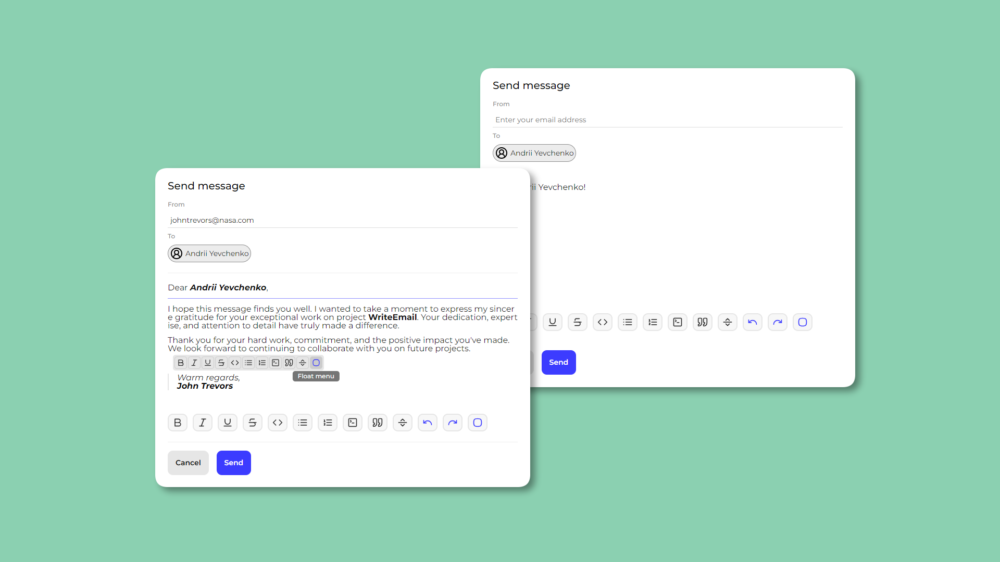
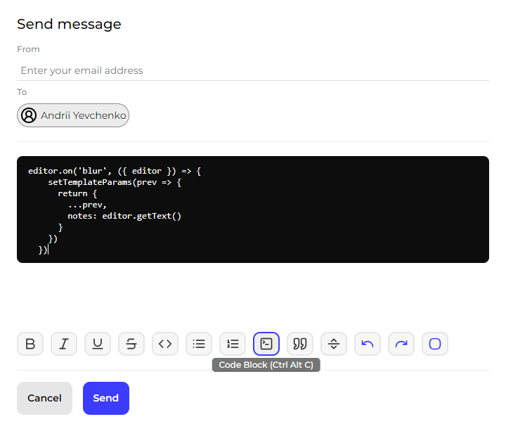

# WriteEmail
_This is a form to send an e-mail to me._ This single component that can be used in future projects.
The project is required for practical training React, and also other technologies.
You can take a look at the project and test it by going to [WriteEmail](https://and-yevchenko.github.io/-react-component-WriteEmail/)

### How to run a project?
WriteEmail uses the VITE build. So in order to build an app need to specify in the console: `npm run vite build`. Then make a deploy of the project, for example on GitHub Pages `npm run gh-pages -d dist`

### What are the features of the WriteEmail project?
WriteEmail has two main abilities. First is it **send an e-mail** to me. The second is a **text editor**. The editor provides various features:
- it's a text change to bold, italic, underline, strike
- creating lists and quotations
- added undo and redo
- added float menu and option to enable/disable the float menu
- can also add code block
More tools can be added as well, but I decided to make a minimalist editor with basic functions.

### What libraries and technologies were used?
First is it [**React**](https://react.dev/). Also used for styles was [**Sass**](https://sass-lang.com/) and icon set [**Lucide**](https://lucide.dev/). To send an e-mail used [**EmailJS**](https://www.emailjs.com/).
To implement the text editor was [**Tiptap**](https://tiptap.dev/docs/editor/introduction) StarterKit and [**Tiptap**](https://tiptap.dev/docs/editor/introduction) API. Tiptap is a friendly wrapper around [**ProseMirror**](https://prosemirror.net/).

### What is the structure of the project?
WriteEmail consists of a main component `WriteEmail.jsx` and optional components `EditorTiptap.jsx` - this is an input field for the editor, and `Tools.jsx` - this is toolbar, or rather these buttons.
File `sendEmail.js` contains basic method to send an email with EmailJS. Also hook `useKnowOS.js` is used to verify the users operating system, required for display tooltips and hotkeys.

### Conclusion
Creating this project has given me good skills in using React and other libraries. I'm planning to use the basis of this project as a component in future projects.
